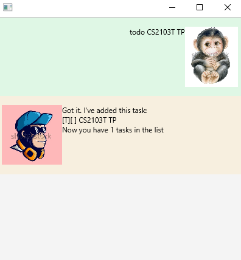
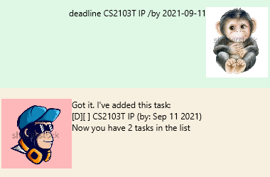
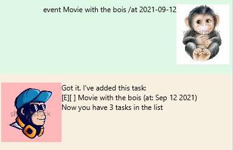
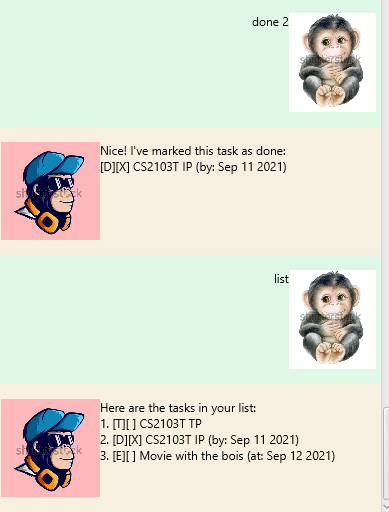
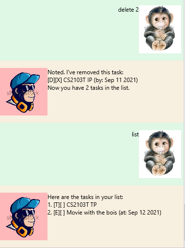

# User Guide
Duke is a next generation chatbot to help you navigate your busy life. The commands are natural and easy to use for any user alike.

You can run the jar file directly if you have the Java Runtime Environment installed. If not, you can install JRE 11+ for this project.

For CLI users, you can run the file directly using java -jar duke.jar
## Features 

### Autosave
Your tasks are saved so that you can view them anytime you want.

### Duplicate tasks detections
Duke is smart enough to know you are adding duplicate tasks to your task list and warn you about it.

## Usage

## Add a task
### `todo` - Add Todo
Adds a todo item with a description

Command syntax: `todo <description>`

Example of usage: 

### `deadline` - Add a deadline

Adds a deadline item with a description and a time.

Command syntax: `deadline <description> /by <time>`

The time needs to be in YYYY-MM-DD format

Example of usage:

### `event` - Add an event

Adds an event item with a description and a time.

Command syntax: `event <description> /at <time>`

The time needs to be in YYYY-MM-DD format

Example of usage:

### `list` - List your tasks

Reads your saved tasks and list them in formatted order

Command syntax: `list`

Example of usage:

### `done` - Mark task as done

Marks specified tasks as done

Command syntax: `done <id>`

Example of usage:

### `delete` - Deletes a task

Deletes specified task from your task list.

Command syntax: `delete <id>`

Example of usage:

